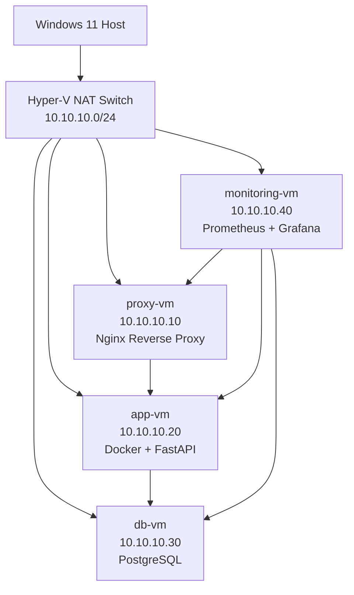

# Architecture Diagram

```mermaid
flowchart TD
    A[Windows 11 Host] --> B[Hyper-V NAT Switch<br/>10.10.10.0/24]

    B --> C[proxy-vm<br/>10.10.10.10<br/>Nginx Reverse Proxy]
    B --> D[app-vm<br/>10.10.10.20<br/>Docker + FastAPI]
    B --> E[db-vm<br/>10.10.10.30<br/>PostgreSQL]
    B --> F[monitoring-vm<br/>10.10.10.40<br/>Prometheus + Grafana]

    C --> D
    D --> E
    F --> C
    F --> D
    F --> E
```
